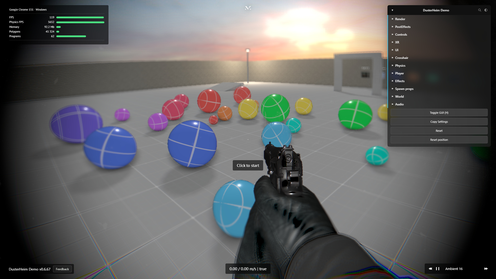
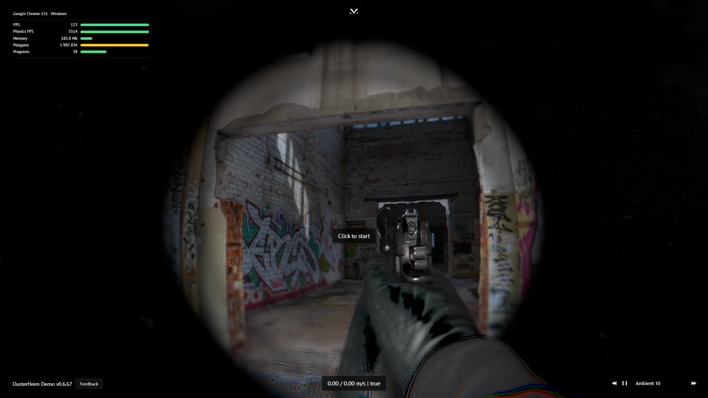
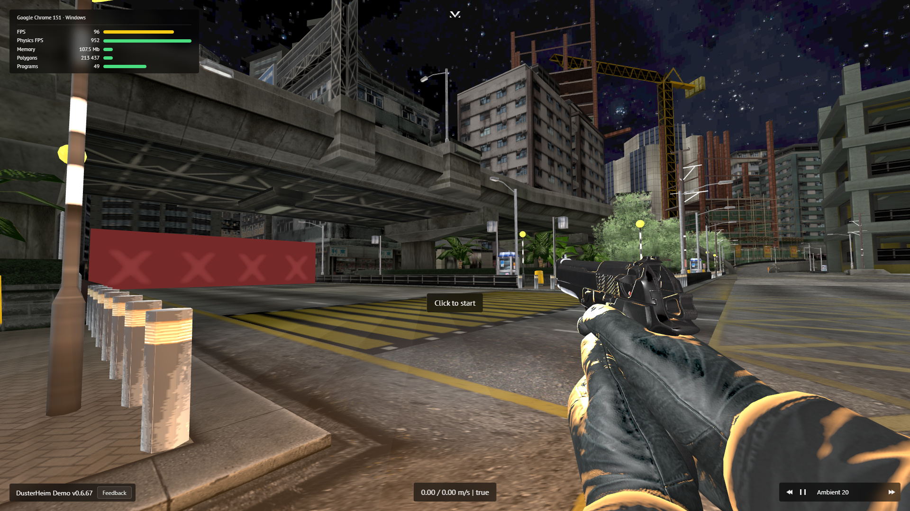
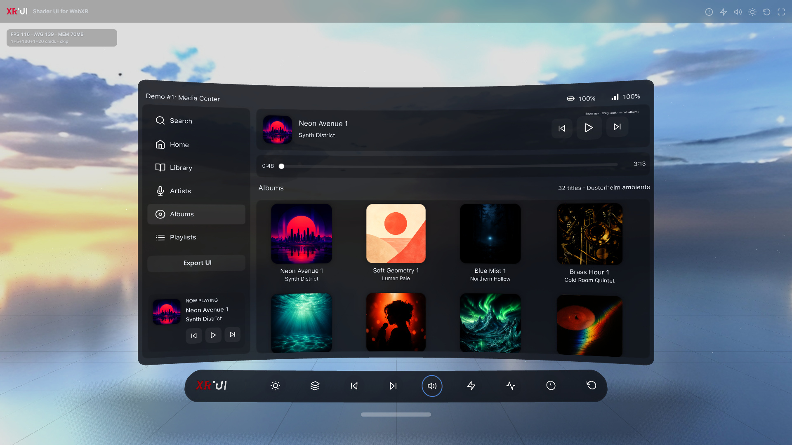
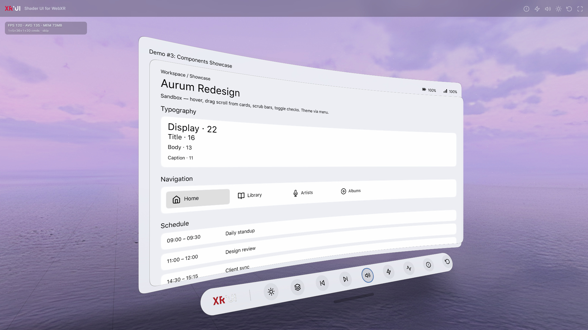
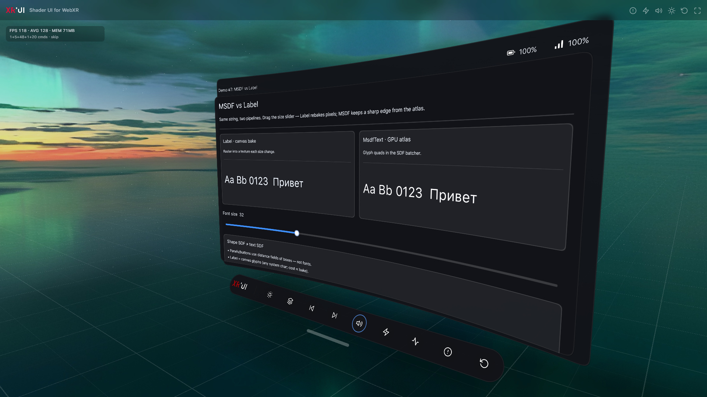
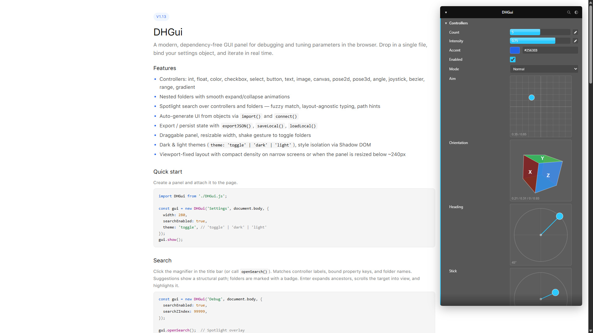
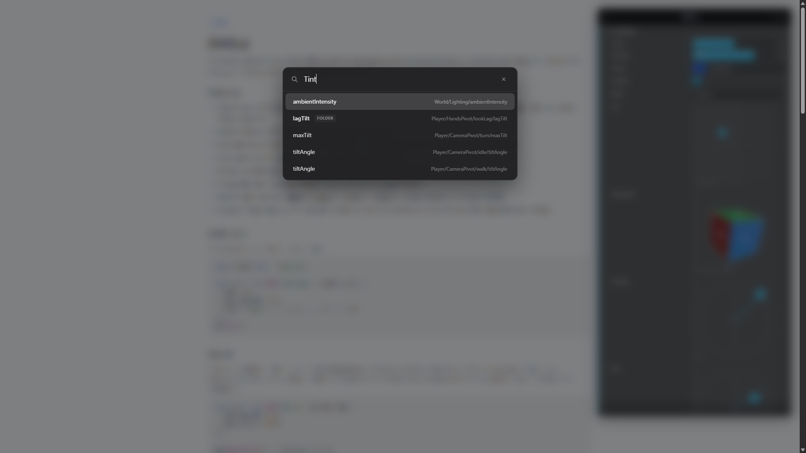

### Hi there 👋

I'm Michael — a front-end & interactions developer based in Novosibirsk, Russia, with over 15 years of experience on dozens of projects, including [Awwwards](https://www.awwwards.com/) websites, 3D promos, games, AR / VR, and more. 
I build WebGL scenes, AR / VR experiments, games in the browser, and interfaces that actually move: JavaScript is the long-term obsession, and I pay a lot of attention to detail, animation, and feel. 
Feel free to reach out if you have a project in mind, or if you just want to say hi.

 

**Skills**

- Creative front-end
- Effects & animations
- AR / VR
- Scroll-driven / narrative experiences
- Procedural & generative graphics
- WebGL / real-time graphics
- UI micro-interactions

**Stack**

- JavaScript / TypeScript / Node.js
- [GSAP](https://gsap.com/) & CSS animations
- Vue (preferred)
- [Three.js](https://threejs.org/)
- [PIXI.js](https://pixijs.com/)
- Canvas 2D
- [Rapier](https://rapier.rs/)
- WebGL / GLSL / WebXR
- Vite / SCSS

---

## Personal Projects

This is only a slice of what I do. I've got dozens of times more side projects, experiments, and half-finished toys sitting around — these are just the ones that are current and polished enough to show.

 

### [DusterHeim](https://michaelchistyakov.com/projects/dusterheim/)

Browser first-person tech demo. Scope and effects are whatever the browser can actually take — visually inspired by [BodyCam](https://store.steampowered.com/app/2406770/Bodycam/) as a reference.

Three.js renderer, Rapier physics, a heavy post-FX stack (GTAO, bloom, body-cam distortion, heat haze, auto-exposure…), desktop / web / Quest (WebXR). In-game debug is [DHGui](https://michaelchistyakov.com/projects/dhgui/); VR panels run on [XRUI](https://michaelchistyakov.com/projects/xrui/).

### [XRUI](https://michaelchistyakov.com/projects/xrui/)

Shader-based UI toolkit for WebXR and Three.js. Layout and draw commands are batched into GPU SDF shaders, then sampled by curved spatial panels — not DOM.

Built so spatial UI is actually usable in a 3D / VR scene: components, glass themes, media, MSDF text. The same library drives in-headset settings inside DusterHeim.

### [DHGui](https://michaelchistyakov.com/projects/dhgui/)

A modern, dependency-free GUI panel for debugging and tuning parameters in the browser. Drop in a single file, bind a settings object, iterate in real time.

Controllers for numbers, color, folders, pose 2D/3D, joysticks, bezier, gradients; spotlight search; dark / light themes; Shadow DOM isolation. Used as the debug panel in DusterHeim.

---

## Elsewhere

- Website — [michaelchistyakov.com](https://michaelchistyakov.com)
- Telegram — [@michael_chistyakov](https://t.me/michael_chistyakov)
- YouTube — [@michael.chistyakov](https://www.youtube.com/@michael.chistyakov)
- LinkedIn — [michaelchistyakov](https://www.linkedin.com/in/michaelchistyakov/)
- Email — [hey@michaelchistyakov.com](mailto:hey@michaelchistyakov.com)

Outside of work I play drums, go cycling, and listen to a lot of music — sometimes I produce my own tracks. Also into tattoos, AR / VR experiments, and small tools for fun.